```{r}
#| label: setup
#| include: false
library(knitr)
```

<!-- ============================================================ -->
<!-- SECTION 1: INTRODUCTION (approx. 5 minutes)                  -->
<!-- ============================================================ -->

# Introduction {background-color="#2c3e50" background-image="img/intro_section.png" background-size="cover" background-opacity="0.2"}

::: {.notes}
Welcome everyone. Over the next 25 minutes, we will explore a topic that sits at the intersection of two rapidly evolving fields: artificial intelligence and vibrational spectroscopy. Specifically, we will discuss why explainability in AI matters when we apply machine learning to FTIR and OPTIR spectroscopic data, and what risks emerge when we treat these models as impenetrable black boxes.
:::

## Why This Talk Matters {auto-animate="true"}

:::: {.columns}

::: {.column width="60%"}

- Spectroscopy generates **high-dimensional, information-rich** data

- AI/ML models are increasingly used for **classification, quantification, and identification**

- Regulatory and scientific communities demand **transparency and reproducibility**

- The gap between model performance and model understanding is **widening**

:::

::: {.column width="40%"}

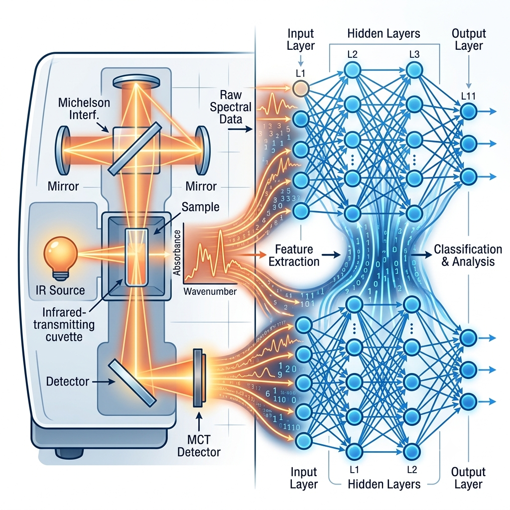{fig-align="center" width="90%"}

:::

::::

::: {.notes}
Let me start by framing why this conversation is urgent. Spectroscopic techniques like FTIR and OPTIR produce datasets with hundreds or thousands of variables per measurement. Machine learning thrives on such data, but the complexity of these models often obscures the chemical reasoning behind predictions. In fields like pharmaceuticals, clinical diagnostics, and environmental monitoring, we cannot afford to deploy models we do not understand. This talk will bridge that gap. Estimated time: 2 minutes.
:::

## FTIR Spectroscopy — A Brief Primer {auto-animate="true"}

:::: {.columns}

::: {.column width="55%"}

**Fourier Transform Infrared Spectroscopy**

- Measures absorption of infrared light by molecular bonds

- Produces a spectrum: **absorbance vs. wavenumber** (typically 4000–400 cm⁻¹)

- Functional group identification via characteristic bands (C=O, O–H, N–H, C–H)

- Widely used in **pharmaceuticals, polymers, food science, forensics**

:::

::: {.column width="45%"}

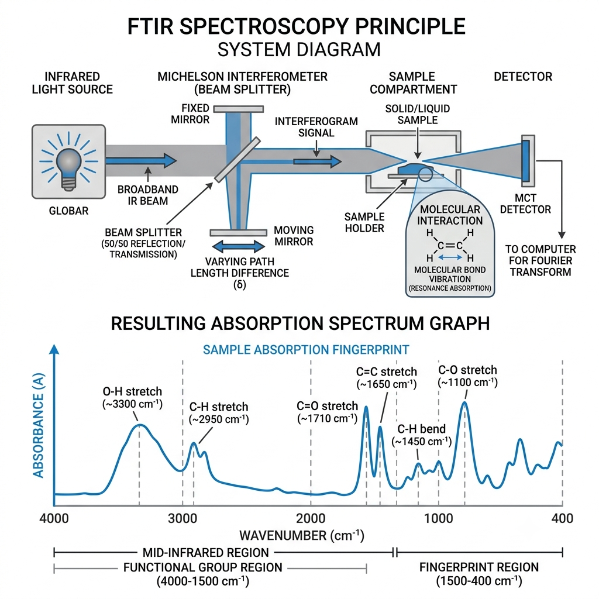{fig-align="center" width="95%"}

:::

::::

::: {.notes}
For those less familiar, FTIR spectroscopy works by passing broadband infrared light through or reflecting it off a sample. Molecular bonds absorb at characteristic frequencies, producing a fingerprint spectrum. Each peak or band corresponds to a specific vibrational mode. This technique has been a workhorse of analytical chemistry for decades, and it generates the kind of structured, high-dimensional data that is very amenable to machine learning approaches. Estimated time: 1.5 minutes.
:::

## OPTIR Spectroscopy — The New Frontier {auto-animate="true"}

:::: {.columns}

::: {.column width="55%"}

**Optical Photothermal Infrared Spectroscopy**

- Overcomes the **diffraction limit** of conventional IR microscopy

- Uses a pulsed, tunable IR laser to heat the sample locally

- A visible probe beam detects the **photothermal response**

- Achieves spatial resolution of **~500 nm** (vs. ~10 µm for FTIR microscopy)

- Ideal for **biological tissues, single cells, microplastics, thin films**

:::

::: {.column width="45%"}

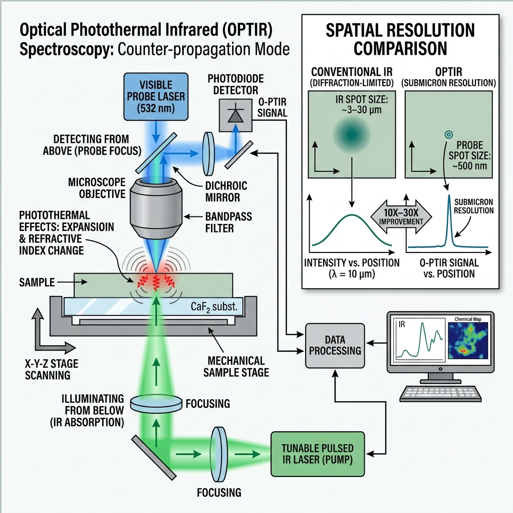{fig-align="center" width="95%"}

:::

::::

::: {.notes}
OPTIR, or Optical Photothermal Infrared spectroscopy, is a more recent technique that has generated enormous excitement. By decoupling the excitation wavelength from the detection wavelength, it achieves submicron spatial resolution while still providing IR-quality chemical information. This means we can now collect spatially resolved IR spectra from individual cells, subcellular compartments, or nanoscale material domains. The data volumes are significantly larger than conventional FTIR, making AI-assisted analysis not just useful but essential. Estimated time: 1.5 minutes.
:::

<!-- ============================================================ -->
<!-- SECTION 2: HISTORY OF AI IN SPECTROSCOPY (approx. 6 minutes) -->
<!-- ============================================================ -->

# History of AI in Data Evaluation {background-color="#8e44ad" background-image="img/history_section.png" background-size="cover" background-opacity="0.2"}

::: {.notes}
Let us now take a step back and look at how we arrived at this point. The marriage of computational methods and spectroscopy is not new — it has evolved over several decades, each era bringing more powerful but also more opaque methods.
:::

## The Timeline of AI in Analytical Science {auto-animate="true"}

```{r}
#| label: timeline-plot
#| fig-width: 11
#| fig-height: 4.5
#| fig-align: center

library(ggplot2)

timeline_data <- data.frame(
  year = c(1960, 1975, 1985, 1995, 2005, 2012, 2018, 2023),
  event = c(
    "Linear Regression\nfor Calibration",
    "PCA & Factor\nAnalysis",
    "PLS Regression\n& PCR",
    "Artificial Neural\nNetworks (ANNs)",
    "Support Vector\nMachines (SVMs)",
    "Deep Learning\nRevolution",
    "CNNs for Spectral\nClassification",
    "Transformers &\nFoundation Models"
  ),
  era = c("Classical", "Classical", "Chemometrics", "Early ML",
           "Early ML", "Deep Learning", "Deep Learning", "Deep Learning")
)

ggplot(timeline_data, aes(x = year, y = 0)) +
  geom_segment(aes(x = 1955, xend = 2026, y = 0, yend = 0),
               color = "grey60", linewidth = 1) +
  geom_point(aes(color = era), size = 5) +
  geom_text(aes(label = event, y = ifelse(seq_along(year) %% 2 == 0, -0.15, 0.15)),
            size = 3.2, lineheight = 0.9, fontface = "bold") +
  geom_segment(aes(xend = year,
                    y = ifelse(seq_along(year) %% 2 == 0, -0.05, 0.05),
                    yend = 0),
               color = "grey40", linetype = "dashed") +
  scale_color_manual(values = c("Classical" = "#3498db",
                                 "Chemometrics" = "#2ecc71",
                                 "Early ML" = "#e67e22",
                                 "Deep Learning" = "#e74c3c")) +
  scale_x_continuous(breaks = timeline_data$year) +
  ylim(-0.35, 0.35) +
  theme_void() +
  theme(
    legend.position = "bottom",
    legend.title = element_blank(),
    legend.text = element_text(size = 10),
    axis.text.x = element_text(size = 9, angle = 45, hjust = 1)
  ) +
  labs(title = "")
```

::: {.notes}
This timeline shows the major milestones. In the 1960s and 70s, we used simple linear models and principal component analysis. The 1980s brought partial least squares regression, which became the gold standard in chemometrics. Neural networks appeared in the 1990s but were limited by computational power. The real shift came after 2012 with deep learning, and today we see convolutional neural networks and even transformer architectures applied to spectral data. Notice the trend: each generation is more powerful but also harder to interpret. Estimated time: 2 minutes.
:::

## Classical Chemometrics Era {auto-animate="true"}

:::: {.columns}

::: {.column width="50%"}

### Transparent by Design

- **PCA**: Loadings directly map to spectral features

- **PLS/PCR**: Regression coefficients interpretable as spectral weights

- **HCA**: Dendrograms show grouping logic

- **MCR-ALS**: Recovers pure component spectra

**Key advantage**: Every step is chemically traceable

:::

::: {.column width="50%"}

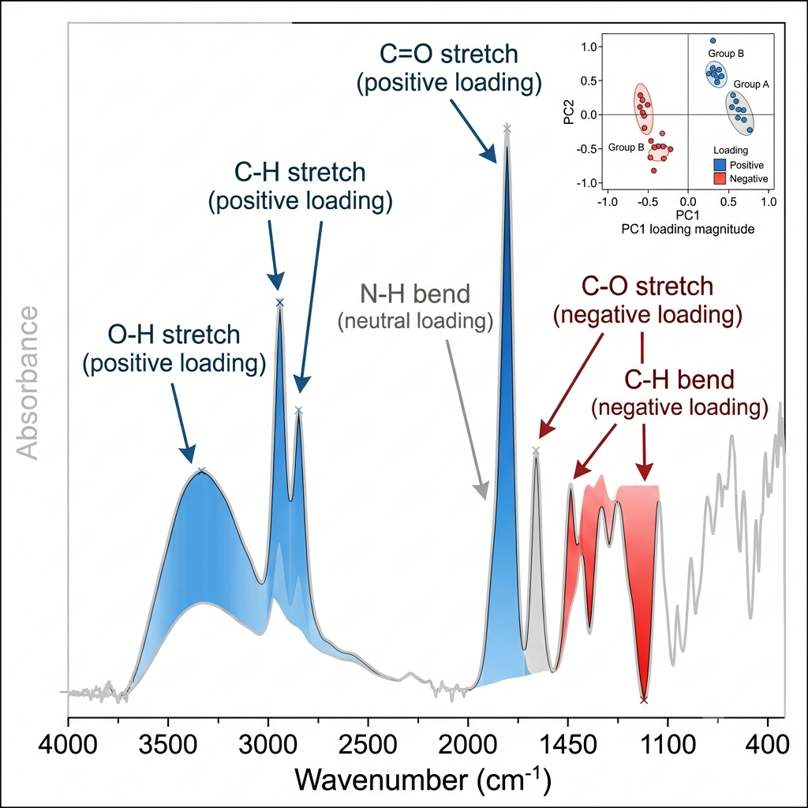{fig-align="center" width="90%"}

:::

::::

::: {.notes}
In the classical chemometrics era, models were inherently interpretable. When you perform PCA on a set of FTIR spectra, the loadings plot tells you exactly which wavenumbers — which molecular vibrations — drive the separation between groups. PLS regression coefficients can be mapped back to specific spectral bands. A trained spectroscopist can look at these outputs and immediately assess whether the model is capturing chemically meaningful information or artefacts. This transparency was not a design choice — it was simply how the mathematics worked. Estimated time: 2 minutes.
:::

## The Deep Learning Shift {auto-animate="true"}

:::: {.columns}

::: {.column width="50%"}

### Power at a Cost

- **1D-CNNs** learn hierarchical spectral features automatically

- **Autoencoders** perform nonlinear dimensionality reduction

- **Transfer learning** enables small-dataset performance

- **Transformers** capture long-range spectral dependencies

**The cost**: Internal representations are not human-readable

:::

::: {.column width="50%"}

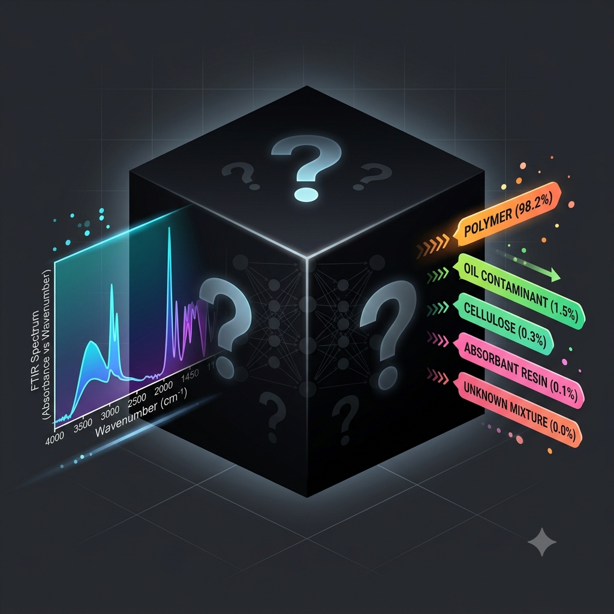{fig-align="center" width="90%"}

:::

::::

::: {.notes}
Then came the deep learning revolution. Convolutional neural networks can be applied directly to raw spectra and often outperform classical methods, especially for complex, overlapping mixtures or subtle spectral differences. But the internal features learned by a CNN — the convolutional filters, the activation patterns — are not directly interpretable as chemical information. We traded transparency for performance. And in many scientific and regulatory contexts, that is a trade we should not make without safeguards. Estimated time: 2 minutes.
:::

<!-- ============================================================ -->
<!-- SECTION 3: BLACK BOX PROBLEM (approx. 6 minutes)             -->
<!-- ============================================================ -->

# Why Black Boxes Are Dangerous {background-color="#c0392b" background-image="img/blackbox_section.png" background-size="cover" background-opacity="0.2"}

::: {.notes}
This brings us to the core argument of this presentation. Why should we care whether our models are interpretable? Is high accuracy not enough? The answer, emphatically, is no — and I will explain why with concrete examples from spectroscopy.
:::

## The Black Box Problem Defined {auto-animate="true"}

:::: {.columns}

::: {.column width="60%"}

A **black box model** is one where:

- Inputs and outputs are known

- The internal decision-making process is **opaque**

- Users cannot determine **why** a specific prediction was made

- There is no way to verify if the model uses **chemically valid** reasoning

### In Spectroscopy This Means:

> *"The model says this is Protein A, but we cannot tell if it used the Amide I band or a baseline artefact to decide."*

:::

::: {.column width="40%"}

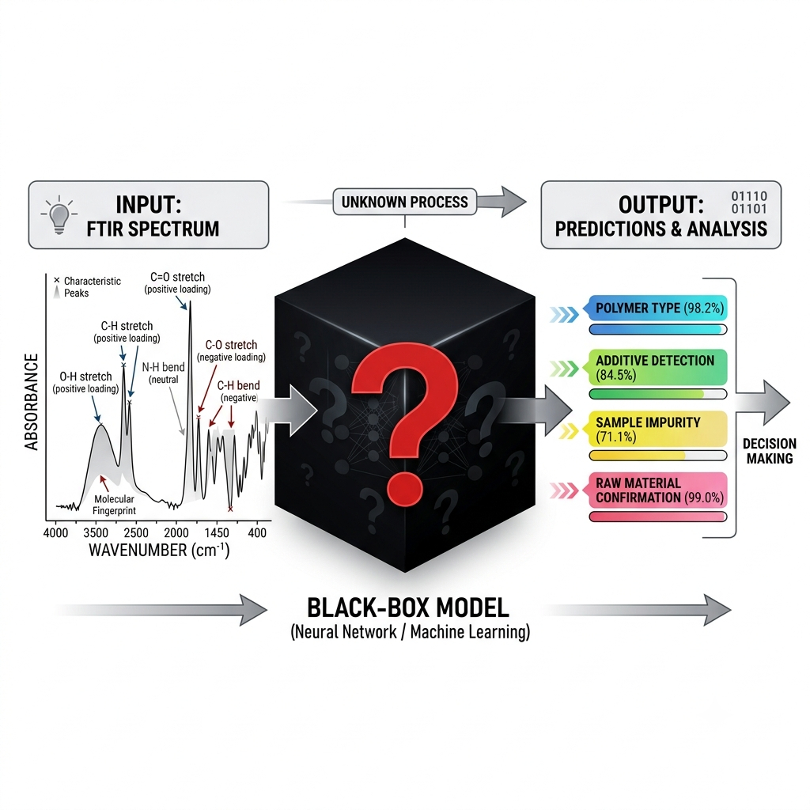{fig-align="center" width="85%"}

:::

::::

::: {.notes}
A black box model gives you an answer but not a reason. In spectroscopy, this is particularly dangerous because spectra contain both chemically meaningful signals and artefacts — baseline drift, atmospheric CO2 absorption, water vapour bands, scattering effects. A model might achieve 99% accuracy on your training set by exploiting an artefact that correlates with your class labels, rather than learning actual chemical differences. Without explainability, you would never know. Estimated time: 2 minutes.
:::

## Real-World Risks of Opaque Models {auto-animate="true"}

:::: {.columns}

::: {.column width="50%"}

### Documented Failures

1. **Spurious correlations**: Models classifying tissue types based on **sample preparation artefacts** rather than biochemistry

2. **Confounding variables**: Instrument-specific features mistaken for sample differences

3. **Shortcut learning**: Models exploiting **label leakage** in spectral datasets

4. **Distribution shift**: Models failing silently on data from **new instruments or protocols**

:::

::: {.column width="50%"}

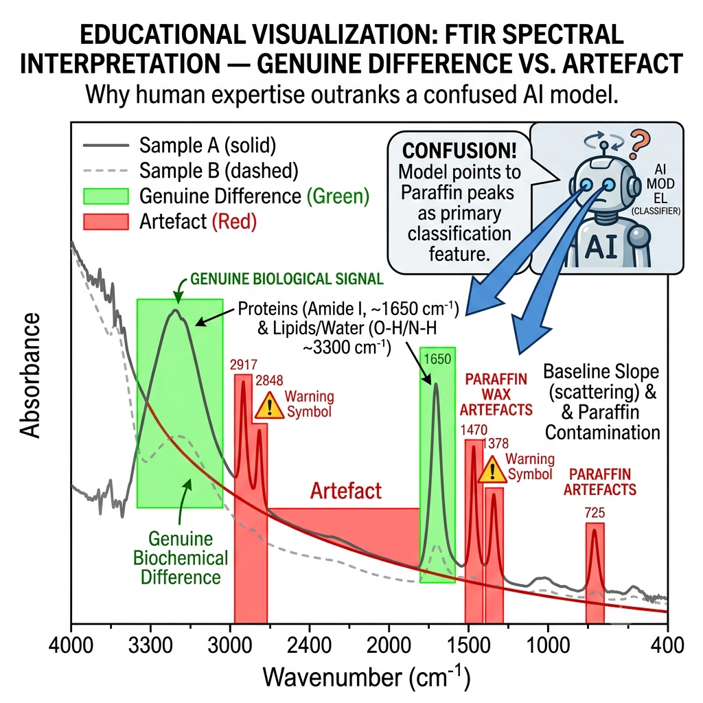{fig-align="center" width="90%"}

:::

::::

::: {.notes}
There are well-documented cases of these failures. In biomedical FTIR spectroscopy, models have been shown to classify tissue samples based on paraffin embedding artefacts rather than actual disease markers. In pharmaceutical applications, models trained on one instrument fail catastrophically when deployed on another because they learned instrument-specific noise patterns. These are not hypothetical risks — they have been published in peer-reviewed literature. An explainable model would have flagged these issues immediately because the important features would not have aligned with expected chemistry. Estimated time: 2 minutes.
:::

## The Regulatory Imperative {auto-animate="true"}

:::: {.columns}

::: {.column width="65%"}

### Compliance Demands Transparency

- **EU AI Act (2024)**: High-risk AI systems require explainability
- **FDA 21 CFR Part 11**: Analytical methods must be validated and understood
- **ISO/IEC 42001**: AI management systems demand risk assessment

### The Scientific Method Requires It Too

- **Reproducibility** requires understanding what a model does
- **Peer review** cannot evaluate what it cannot see
- **Knowledge generation** demands mechanistic insight

:::

::: {.column width="35%"}

{fig-align="center" width="90%"}

:::

::::

::: {.notes}
Beyond scientific integrity, there are regulatory reasons to demand explainability. The European Union's AI Act explicitly requires that high-risk AI systems provide explanations for their decisions. In pharmaceutical contexts, the FDA expects that analytical methods — including those using AI — be fully validated, and validation implies understanding. The scientific method itself is predicated on the idea that we understand our tools. A model that works but cannot be explained is an oracle, not a scientific instrument. Estimated time: 2 minutes.
:::

<!-- ============================================================ -->
<!-- SECTION 4: EXPLAINABLE AI METHODS (approx. 4 minutes)        -->
<!-- ============================================================ -->

# Explainable AI: Methods & Tools {background-color="#27ae60" background-image="img/xai_section.png" background-size="cover" background-opacity="0.2"}

::: {.notes}
So what can we do about it? Fortunately, the field of Explainable AI — or XAI — has developed a rich toolkit that can be applied to spectroscopic models. Let me walk you through the most relevant approaches.
:::

## XAI Taxonomy for Spectroscopy {auto-animate="true"}

```{r}
#| label: xai-taxonomy
#| fig-width: 10
#| fig-height: 5
#| fig-align: center

library(ggplot2)

xai_data <- data.frame(
  method = c("SHAP", "LIME", "Grad-CAM", "Integrated\nGradients",
             "Attention\nWeights", "Partial\nDependence",
             "Inherently\nInterpretable", "Counterfactual\nExplanations"),
  type = c("Post-hoc", "Post-hoc", "Post-hoc", "Post-hoc",
           "Built-in", "Post-hoc", "Built-in", "Post-hoc"),
  fidelity = c(9, 7, 8, 8.5, 7.5, 6, 10, 7),
  complexity = c(7, 5, 6, 7, 4, 3, 2, 6)
)

ggplot(xai_data, aes(x = complexity, y = fidelity,
                      color = type, label = method)) +
  geom_point(size = 6, alpha = 0.8) +
  geom_text(vjust = -1.2, size = 3.5, fontface = "bold") +
  scale_color_manual(values = c("Post-hoc" = "#e74c3c",
                                 "Built-in" = "#27ae60")) +
  xlim(1, 9) + ylim(5, 11) +
  labs(x = "Implementation Complexity",
       y = "Explanation Fidelity",
       color = "Type") +
  theme_minimal(base_size = 14) +
  theme(legend.position = "bottom",
        panel.grid.minor = element_blank())
```

::: {.notes}
This plot maps the XAI landscape along two axes: how faithful the explanation is to the model's actual reasoning, and how complex it is to implement. SHAP values — based on Shapley values from game theory — provide the most theoretically grounded post-hoc explanations. LIME offers local, model-agnostic explanations. Gradient-based methods like Grad-CAM and Integrated Gradients work specifically with neural networks. Inherently interpretable models, like penalised linear models or decision trees, sit at the top-left: perfect fidelity with low complexity, but potentially lower predictive power. Estimated time: 2 minutes.
:::

## SHAP for Spectral Interpretation {auto-animate="true"}

:::: {.columns}

::: {.column width="55%"}

### SHapley Additive exPlanations

- Assigns each **wavenumber** a contribution to the prediction

- Based on **coalitional game theory** — fair attribution

- Produces spectral importance maps that align with **chemical knowledge**

- Can reveal if a model focuses on:
  - ✅ Amide I/II bands (meaningful)
  - ❌ CO₂ region at 2349 cm⁻¹ (artefact)
  - ❌ Baseline slope (instrument noise)


:::

::: {.column width="45%"}

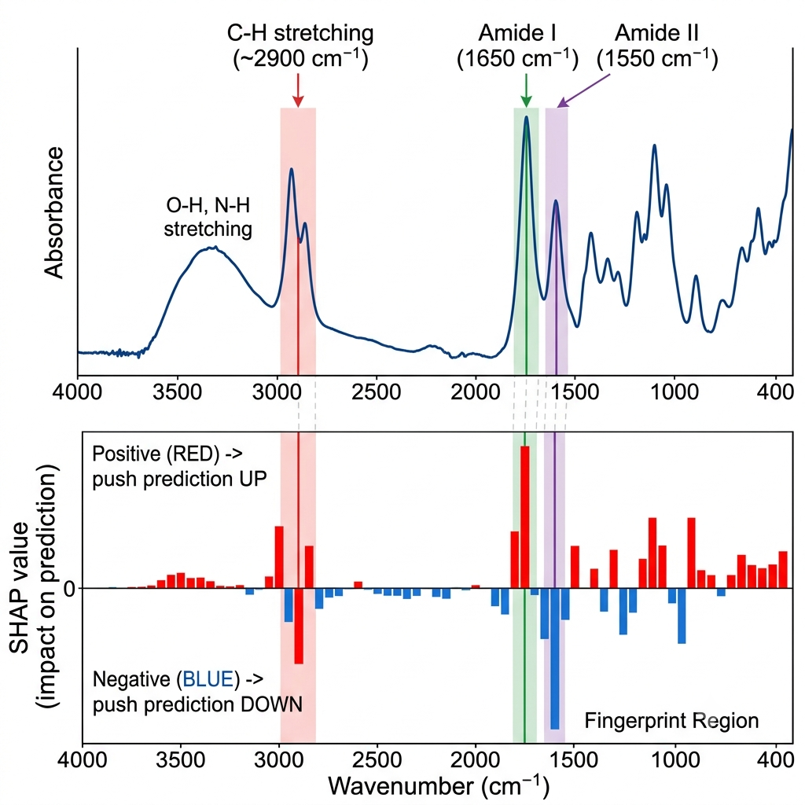{fig-align="center" width="95%"}

:::

::::

::: {.notes}
SHAP is particularly powerful for spectroscopic data because the explanations are in the same domain as the input — wavenumber space. A SHAP plot for a spectral classification model shows you exactly which spectral regions drive the prediction. You can immediately compare this to known absorption bands and assess whether the model is learning chemistry or artefacts. For OPTIR data with spatial dimensions, you can create SHAP maps that show not just which wavenumbers matter but where in the sample they matter. This is a transformative capability for tissue analysis and materials characterisation. Estimated time: 2 minutes.
:::

<!-- ============================================================ -->
<!-- SECTION 5: THREATS & ETHICS (approx. 4 minutes)              -->
<!-- ============================================================ -->

# Threats & Ethical Considerations {background-color="#d35400" background-image="img/ethics_section.png" background-size="cover" background-opacity="0.2"}

::: {.notes}
Now let us turn to the broader ethical landscape. Even when we use explainable models, there are significant threats and ethical considerations that the spectroscopy community must confront.
:::

## Bias in Spectroscopic AI {auto-animate="true"}

:::: {.columns}

::: {.column width="65%"}

### Sources of Bias

- **Dataset bias**: Training sets dominated by specific populations, instruments, or sample preparations
- **Label bias**: Expert annotations reflecting individual diagnostic tendencies
- **Measurement bias**: Systematic differences between instruments, labs, or protocols
- **Selection bias**: Published models trained on curated "clean" datasets that do not represent real-world variability


:::

::: {.column width="35%"}

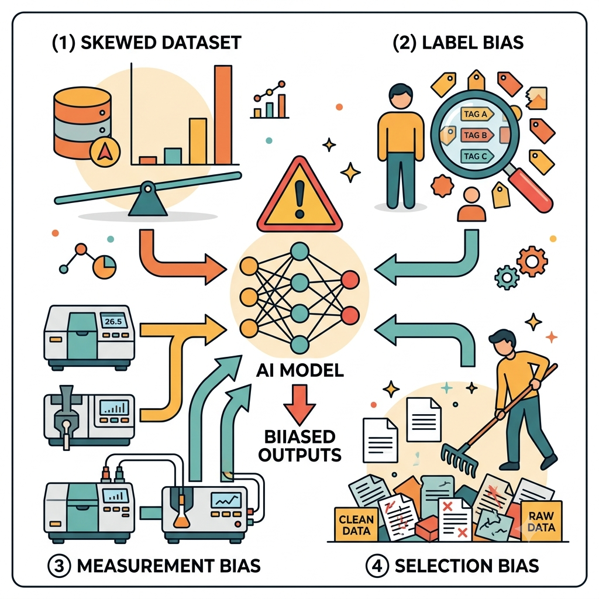{fig-align="center" width="90%"}

:::

::::

::: {.notes}
Bias in spectroscopic AI is multifaceted. If your training set contains FTIR spectra only from one instrument, the model learns that instrument's characteristics as if they were chemical features. If your biomedical training data comes predominantly from one ethnic group, the model may not generalise. If your labels were assigned by a single pathologist, the model learns that individual's diagnostic style. These biases are often invisible unless we specifically test for them, and explainability tools can help — if a model's important features include instrument-specific artefacts, that is a red flag. Estimated time: 2 minutes.
:::


## Bias in Spectroscopic AI {auto-animate="true"}

:::: {.columns}

::: {.column width="65%"}


### Consequences

- Models that perform well in one lab but **fail in another**
- Diagnostic models biased toward **specific demographics**
- Overconfident predictions on **out-of-distribution** samples

:::

::: {.column width="35%"}

{fig-align="center" width="90%"}

:::

::::

::: {.notes}
Bias in spectroscopic AI is multifaceted. If your training set contains FTIR spectra only from one instrument, the model learns that instrument's characteristics as if they were chemical features. If your biomedical training data comes predominantly from one ethnic group, the model may not generalise. If your labels were assigned by a single pathologist, the model learns that individual's diagnostic style. These biases are often invisible unless we specifically test for them, and explainability tools can help — if a model's important features include instrument-specific artefacts, that is a red flag. Estimated time: 2 minutes.
:::


## Environmental & Societal Costs {auto-animate="true"}

:::: {.columns}

::: {.column width="55%"}

### Carbon Footprint of AI

- Training a large transformer model can emit **>300 tonnes of CO₂**
- Hyperparameter searches multiply this by **10–100×**

- Spectroscopic foundation models require **massive computational resources**

### The Proportionality Question

- Is a 2% accuracy improvement worth **weeks of GPU time**?
- Should we prefer **efficient, interpretable models** when they perform comparably?

:::

::: {.column width="45%"}

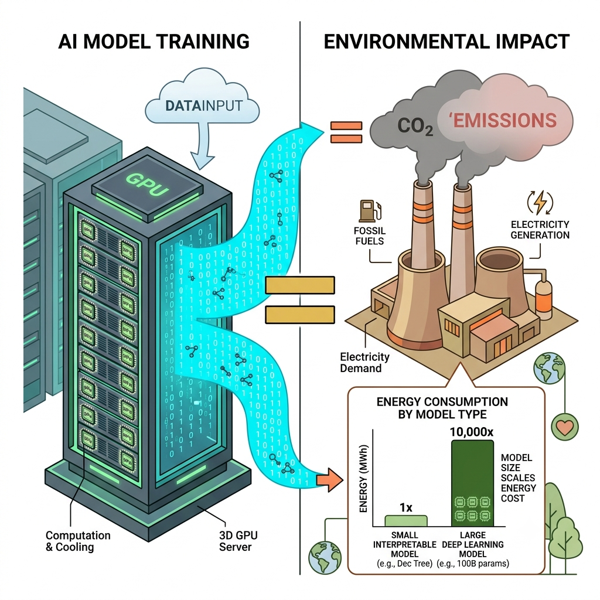{fig-align="center" width="90%"}

:::

::::

::: {.notes}
The environmental cost of AI is substantial and often overlooked in the spectroscopy community. Training deep learning models requires significant energy, and the carbon footprint is real. When a simpler, interpretable model achieves 97% accuracy and a deep neural network achieves 99%, we must ask whether that marginal improvement justifies the environmental cost. There are also data privacy concerns — spectral data from patients is health information, and processing it through cloud-based AI systems raises sovereignty and compliance questions. Estimated time: 2 minutes.
:::


## Environmental & Societal Costs {auto-animate="true"}

:::: {.columns}

::: {.column width="55%"}

### Data Sovereignty & Privacy

- Patient spectral data as **personal health information**
- Cross-border data flows for cloud-based AI processing
- Proprietary spectral libraries and **intellectual property** concerns

:::

::: {.column width="45%"}

{fig-align="center" width="90%"}

:::

::::

::: {.notes}
The environmental cost of AI is substantial and often overlooked in the spectroscopy community. Training deep learning models requires significant energy, and the carbon footprint is real. When a simpler, interpretable model achieves 97% accuracy and a deep neural network achieves 99%, we must ask whether that marginal improvement justifies the environmental cost. There are also data privacy concerns — spectral data from patients is health information, and processing it through cloud-based AI systems raises sovereignty and compliance questions. Estimated time: 2 minutes.
:::


## Reproducibility & Trust Erosion {auto-animate="true"}

:::: {.columns}

::: {.column width="55%"}

### The Reproducibility Crisis Meets AI

- Many published spectroscopic AI models **cannot be reproduced**

- Common issues:
  - Missing preprocessing details
  - Unreported data splits
  - No code or model availability
  - Hardware-dependent results

:::

::: {.column width="45%"}

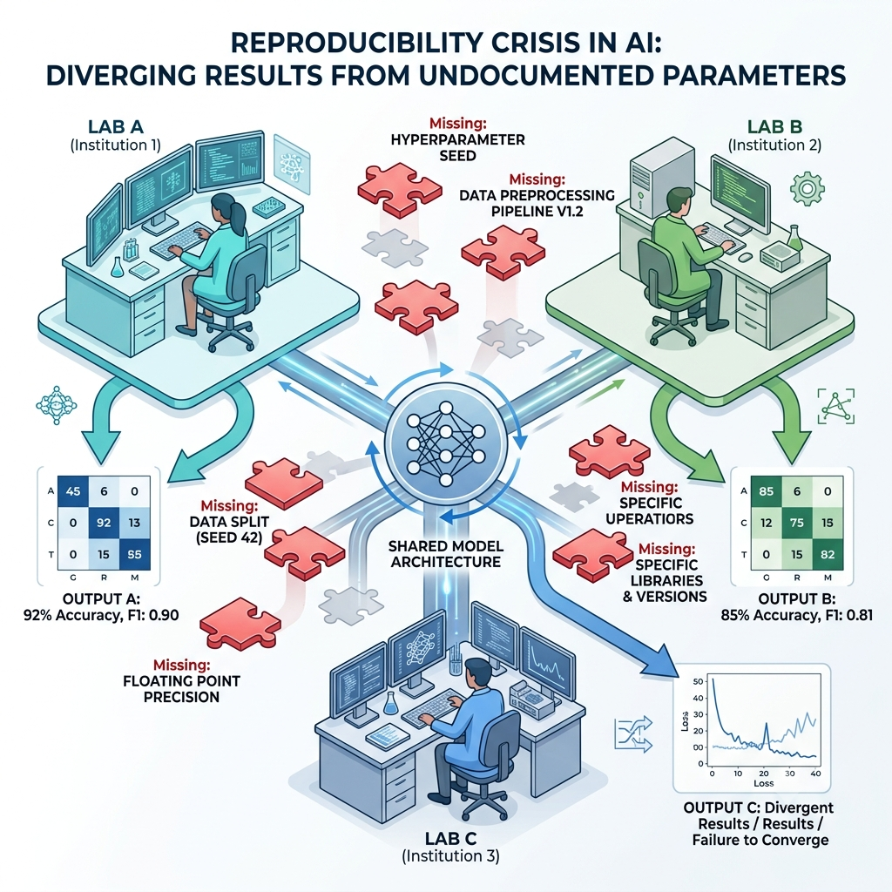{fig-align="center" width="90%"}

:::

::::

::: {.notes}
Finally, the reproducibility crisis in science is amplified by AI. Many published spectroscopic ML studies lack sufficient detail to reproduce the results. Without standardised reporting — including model architectures, hyperparameters, preprocessing steps, data splits, and explainability analyses — we risk building a literature of irreproducible claims. The solution is a combination of open science practices, mandatory explainability reporting, and community standards for spectroscopic AI. Estimated time: 2 minutes.
:::


## Reproducibility & Trust Erosion {auto-animate="true"}

:::: {.columns}

::: {.column width="55%"}


### Trust Erosion

- Clinicians will not adopt tools they **do not understand**
- Regulators will not approve methods they **cannot audit**
- Scientists should not publish results they **cannot explain**

### The Path Forward

- **Open models, open data, open code**
- **Standardised reporting** (model cards, datasheets)
- **Mandatory XAI** for high-stakes applications

:::

::: {.column width="45%"}

{fig-align="center" width="90%"}

:::

::::

::: {.notes}
Finally, the reproducibility crisis in science is amplified by AI. Many published spectroscopic ML studies lack sufficient detail to reproduce the results. Without standardised reporting — including model architectures, hyperparameters, preprocessing steps, data splits, and explainability analyses — we risk building a literature of irreproducible claims. The solution is a combination of open science practices, mandatory explainability reporting, and community standards for spectroscopic AI. Estimated time: 2 minutes.
:::


<!-- ============================================================ -->
<!-- SECTION 6: CONCLUSIONS & RECOMMENDATIONS (approx. 2 minutes) -->
<!-- ============================================================ -->

# Conclusions & Recommendations {background-color="#2c3e50" background-image="img/conclusions_section.png" background-size="cover" background-opacity="0.2"}

## Key Takeaways {auto-animate="true"}

:::: {.columns}

::: {.column width="50%"}

### Principles

1. **Accuracy without understanding is insufficient** for scientific applications

2. **Explainability is not optional** — it is a scientific and regulatory requirement

3. **OPTIR and FTIR data** are ideal testbeds for XAI because chemical ground truth exists

4. **Bias, carbon cost, and reproducibility** are ethical imperatives, not afterthoughts

:::

::: {.column width="50%"}

### Recommendations

1. Always apply **at least one XAI method** (SHAP, LIME, or gradient-based)

2. Validate explanations against **known spectral assignments**

3. Report **model cards** with every publication

4. Prefer **interpretable models** when performance is comparable

5. Consider **environmental cost** in model selection

6. Demand **open data and open code**

:::

::::

::: {.notes}
Let me leave you with these key messages. First, in spectroscopy, we have a unique advantage: we know what the features should mean. Use that knowledge to validate your models. Second, explainability is not a luxury — it is a necessity for scientific integrity, regulatory compliance, and clinical trust. Third, consider the full cost of your modelling choices, including environmental and ethical dimensions. And finally, embrace open science practices to ensure that our field advances on a foundation of reproducible, transparent research. Estimated time: 1.5 minutes.
:::

## Recommended Resources {auto-animate="true"}

:::: {.columns}

::: {.column width="50%"}

### Books & Reviews

- Molnar, C. — *Interpretable Machine Learning* (2nd ed.)
- Barker, M. & Rayens, W. — *Chemometrics and Intelligent Laboratory Systems*

### Software

- `SHAP` (Python) — [github.com/shap/shap](https://github.com/shap/shap)
- `LIME` (Python/R) — [github.com/marcotcr/lime](https://github.com/marcotcr/lime)
- `iml` (R) — Interpretable Machine Learning package
- `DALEX` (R/Python) — moDel Agnostic Language for Exploration and eXplanation

:::

::: {.column width="50%"}

### Key Papers

- Ribeiro et al. (2016) — *"Why Should I Trust You?" — LIME*
- Lundberg & Lee (2017) — *SHAP: A Unified Approach*
- Baker et al. (2014) — *Using FTIR for clinical biofluids analysis*


### Standards

- EU AI Act (2024)
- ISO/IEC 42001:2023
- FAIR Data Principles

:::

::::

::: {.notes}
Here are some resources for further reading. Christoph Molnar's book on interpretable machine learning is freely available online and is an excellent starting point. For spectroscopy-specific applications, the papers by Baker and colleagues and by Ghosh and colleagues are particularly relevant. On the software side, SHAP and LIME are the most widely used tools, and both have R and Python implementations. Estimated time: 0.5 minutes.
:::

## Thank You for Your Attention {background-image="img/thank_you.png" background-size="cover" background-position="center" style="color: white; text-shadow: 3px 3px 10px black;"}

### Questions & Discussion

::: {.r-fit-text}
📧 krzysztof@nus.edu.sg

🔗 https://krzbanas.github.io/presentation-hub/
:::

::: {.notes}
Thank you very much for your attention. I am happy to take questions. Whether you are interested in the technical details of specific XAI methods, the regulatory landscape, or practical implementation for your own spectroscopic data, I welcome the discussion. Estimated time: remaining time for Q&A.
:::
