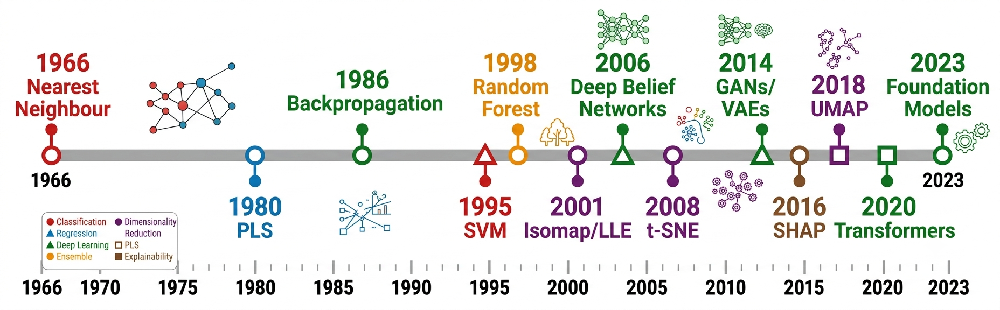
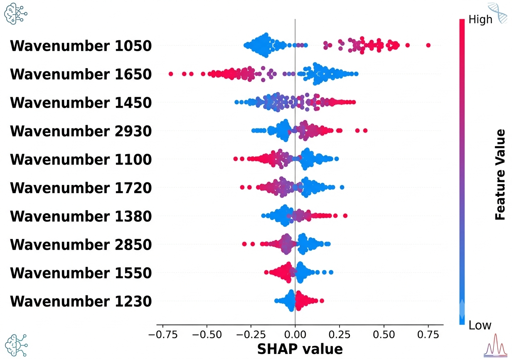
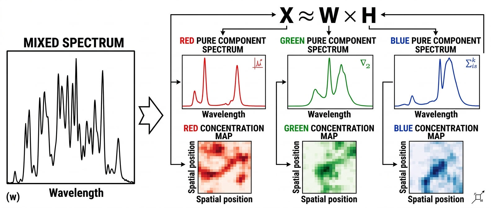
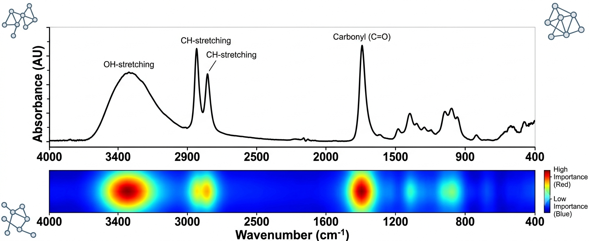

```{r setup}
#| include: false

# CRITICAL: load randomForest BEFORE ggplot2 so ggplot2::margin() wins
library(randomForest)

library(tidyverse)
library(ggplot2)
library(patchwork)
library(viridis)
library(uwot)
#library(Rtsne)
library(cluster)
library(factoextra)
library(caret)
library(e1071)
#library(NMF)
library(reshape2)
library(ggrepel)
library(scales)

# Force ggplot2::margin everywhere — resolve namespace conflict
margin <- ggplot2::margin

set.seed(42)

# ── Global theme with large readable fonts ──
theme_set(
 theme_minimal(base_size = 20) +
   theme(
     plot.title   = element_text(size = 22, face = "bold", hjust = 0.5),
     axis.title   = element_text(size = 18),
     axis.text    = element_text(size = 15),
     legend.title = element_text(size = 16),
     legend.text  = element_text(size = 14),
     strip.text   = element_text(size = 16, face = "bold"),
     plot.margin  = ggplot2::margin(10, 10, 10, 10)
   )
)
```

## Outline {.smaller}

::::: columns
::: {.column width="50%"}
**Part I — Foundations**

- Why AI for spectroscopy?
- The analytical pipeline
- Timeline of key milestones

**Part II — Dimension Reduction**

- PCA, NMF, t-SNE, UMAP
- 🔬 *Case 1 — Honey FTIR*

**Part III — Clustering**

- k-Means, HCA, DBSCAN, GMM
- 🔬 *Case 2 — OPTIR Dentin / Enamel*
:::

::: {.column width="50%"}
**Part IV — Building Models**

- PLS-DA, Random Forest, SVM, CNN
- 🔬 *Case 3 — XRF Halobates Mapping*

**Part V — Explainable AI (XAI)**

- SHAP, LIME, Grad-CAM
- Loadings & variable importance as XAI

**Part VI — Summary & Best Practices**

- Workflow integration
- Common pitfalls
:::
:::::

::: notes
Welcome. Over the next 40 minutes we will walk through a complete
analytical pipeline — from raw spectra to explainable predictions —
illustrated with three real-world case studies. Each section pairs
theory with live R code.
:::

# Part I — Foundation {background-image="GRAPHICS/bg_foundations.png" background-size="cover" background-opacity="0.3"}

::: notes
:::

## Why AI for Spectroscopy? {.smaller}

::::: columns
::: {.column width="55%"}
Spectroscopic and elemental-mapping datasets are **high-dimensional**,
**multivariate**, and often **spatially resolved**.

Traditional univariate analysis (peak height / area) ignores
correlations between variables and struggles when:

- Classes overlap in single-band space
- Subtle compositional gradients matter
- Hundreds of thousands of spectra must be classified

**Machine-learning** provides systematic tools for:

1.  **Reducing** dimensionality while preserving structure
2.  **Discovering** natural groupings (unsupervised)
3.  **Predicting** class or quantity (supervised)
4.  **Explaining** which features drive decisions (XAI)
:::

::: {.column width="45%"}
```{r}
#| label: fig-pipeline
#| fig-cap: "Analytical pipeline overview"
#| fig-height: 7
#| fig-width: 6

steps <- tibble(
  y = 6:1,
  label = c("Raw Spectra / Maps",
            "Pre-processing",
            "Dimension Reduction",
            "Clustering / Classification",
            "Model Evaluation",
            "Explainability (XAI)"),
  col = c("#2196F3","#4CAF50","#FF9800","#E91E63","#9C27B0","#00BCD4")
)

ggplot(steps, aes(x = 1, y = y)) +
  geom_tile(aes(fill = col), width = 3.2, height = 0.75,
            colour = "white", linewidth = 1.5) +
  geom_text(aes(label = label), size = 6.5, fontface = "bold",
            colour = "white") +
  geom_segment(data = steps |> filter(y > 1),
               aes(x = 1, xend = 1, y = y - 0.45, yend = y - 0.55),
               arrow = arrow(length = unit(0.25, "cm")),
               linewidth = 1.2, colour = "grey40") +
  scale_fill_identity() +
  coord_cartesian(xlim = c(-1, 3)) +
  theme_void() +
  theme(plot.margin = ggplot2::margin(5, 5, 5, 5))
```
:::
:::::

::: notes
Spectroscopic data are inherently multivariate. A single FTIR spectrum
has hundreds to thousands of absorbance values. When you multiply that
by hundreds of samples — or millions of pixels in a map — you need
systematic tools. That is exactly what machine-learning provides.
:::

## Timeline of AI in Spectroscopy {.smaller}

{width="90%"
fig-cap="Key milestones — AI meets spectroscopy"}

::: notes
This timeline highlights how chemometrics evolved from classical PCA in
the 1960s through machine-learning classifiers in the 1990s–2000s, to
deep learning and explainability frameworks in the last decade. The
field is now entering an era of foundation models.
:::

# Part II — Dimension Reduction {background-image="GRAPHICS/bg_dimreduction.png" background-size="cover" background-opacity="0.3"}

::: notes
Part two covers the main dimension-reduction techniques. We will focus
on PCA because it also provides built-in explainability through
loadings, then compare with NMF, t-SNE, and UMAP.
:::

## PCA — Principal Component Analysis {.smaller}

::::: columns
::: {.column width="50%"}
**Goal:** project high-dimensional data onto orthogonal axes of maximum
variance.

**Key properties:**

- Linear, deterministic, fast
- Variance explained → scree plot
- **Loadings** = contribution of each original variable → built-in XAI
- Sensitive to scaling → always standardise or use SNV/mean-centre

**Maths (SVD form):**

$$\mathbf{X} = \mathbf{U}\,\boldsymbol{\Sigma}\,\mathbf{V}^{\!\top}$$

- Scores: $\mathbf{T} = \mathbf{U}\,\boldsymbol{\Sigma}$
- Loadings: $\mathbf{V}$
:::

::: {.column width="50%"}
```{r}
#| label: fig-pca-concept
#| fig-cap: "PCA finds directions of maximum variance"
#| fig-height: 5
#| fig-width: 6

set.seed(7)
demo <- MASS::mvrnorm(120, mu = c(0, 0),
                      Sigma = matrix(c(3, 1.8, 1.8, 1.5), 2))
demo_df <- as.data.frame(demo) |> setNames(c("x", "y"))
pc <- prcomp(demo_df)
slopes <- pc$rotation

ggplot(demo_df, aes(x, y)) +
  geom_point(alpha = 0.5, size = 3, colour = "#1565C0") +
  geom_segment(aes(x = 0, y = 0,
                   xend = slopes[1,1]*3, yend = slopes[2,1]*3),
               arrow = arrow(length = unit(0.3, "cm")),
               colour = "#E91E63", linewidth = 1.5) +
  geom_segment(aes(x = 0, y = 0,
                   xend = slopes[1,2]*2, yend = slopes[2,2]*2),
               arrow = arrow(length = unit(0.3, "cm")),
               colour = "#FF9800", linewidth = 1.5) +
  annotate("text", x = slopes[1,1]*3.3, y = slopes[2,1]*3.3,
           label = "PC1", size = 7, fontface = "bold", colour = "#E91E63") +
  annotate("text", x = slopes[1,2]*2.3, y = slopes[2,2]*2.3,
           label = "PC2", size = 7, fontface = "bold", colour = "#FF9800") +
  coord_fixed() +
  labs(x = "Variable 1", y = "Variable 2")
```
:::
:::::

::: notes
PCA is the workhorse of chemometrics. It decomposes the data matrix into
scores and loadings via singular-value decomposition. Scores tell you
where each sample sits in reduced space; loadings tell you which
original variables — which wavenumbers — are responsible. That makes
loadings a natural form of explainability.
:::

## NMF, t-SNE, UMAP — Comparison {.smaller}

| Method    | Linear? | Preserves           | Interpretable components? | Speed    |
|-----------|---------|---------------------|---------------------------|----------|
| **PCA**   | ✅      | Global variance     | ✅ Loadings               | Fast     |
| **NMF**   | ✅      | Parts-based (≥ 0)   | ✅ Basis spectra          | Moderate |
| **t-SNE** | ❌      | Local neighbours    | ❌                        | Slow     |
| **UMAP**  | ❌      | Local + some global | ❌                        | Fast     |

<br>

**Rule of thumb:**

- Use **PCA** for exploration + explainability
- Use **NMF** when data are non-negative (spectra!) and you want
  physically meaningful components
- Use **t-SNE / UMAP** for visualisation of clusters — but never for
  quantitative distance interpretation

::: notes
Each method has trade-offs. PCA and NMF give you interpretable
components — loadings or basis spectra — which is crucial for
explainability. t-SNE and UMAP are powerful for visualisation but their
axes have no physical meaning. In spectroscopy, non-negativity makes NMF
especially attractive because basis spectra look like real spectra.
:::

# 🔬 Case Study 1 — Honey FTIR {background-image="GRAPHICS/photo_honey.png" background-size="cover" background-opacity="0.3"}

Can we recognise the country of origin from mid-IR spectra?

::: notes
Our first case study. We have FTIR spectra of honey samples from
different countries. The question: can we identify geographic origin?
This is relevant for food authentication and fraud detection.
:::

## Load & Visualise Honey Spectra {.smaller}

```{r}
#| label: fig-honey-raw
#| fig-cap: "Raw FTIR spectra of honey samples coloured by country"
#| fig-height: 5.5
#| fig-width: 12

honey_raw   <- read.csv("Honey_Spectra_wide_A.csv", check.names = FALSE)
honey_names <- honey_raw[[1]]

# Country code is the first two characters (e.g. "AU", "CN", "GB", "NZ", "PL")
honey_country <- sub("^(\\S+)\\s.*", "\\1", honey_names)

honey_mat <- as.matrix(honey_raw[, -1])
wn_honey  <- as.numeric(colnames(honey_mat))

honey_long <- tibble(
  Sample     = rep(honey_names, each = length(wn_honey)),
  Country    = rep(honey_country, each = length(wn_honey)),
  Wavenumber = rep(wn_honey, times = nrow(honey_mat)),
  Absorbance = as.vector(t(honey_mat))
)

# Build palette from the unique country codes actually present
unique_countries <- sort(unique(honey_country))
country_pal      <- setNames(
  RColorBrewer::brewer.pal(max(3, length(unique_countries)), "Set1"),
  unique_countries
)

ggplot(honey_long, aes(Wavenumber, Absorbance,
                       group = Sample, colour = Country)) +
  geom_line(alpha = 0.5, linewidth = 0.4) +
  scale_x_reverse() +
  scale_colour_manual(values = country_pal) +
  labs(x = expression("Wavenumber / cm"^{-1}), y = "Absorbance") +
  theme(legend.position = "top")
```

::: notes
Here are the raw FTIR spectra coloured by country. You can already see
some grouping — the New Zealand and Australian samples tend to have
slightly different profiles around 1000–1200 wavenumbers — but it is
hard to judge by eye. Let us use PCA to make this clearer.
:::

## PCA of Honey Spectra {.smaller}

```{r}
#| label: fig-honey-pca
#| fig-cap: "PCA scores and scree plot for honey FTIR data"
#| fig-height: 5.5
#| fig-width: 13

honey_pca <- prcomp(honey_mat, center = TRUE, scale. = FALSE)
n_pcs     <- min(10, ncol(honey_pca$x))
var_exp   <- summary(honey_pca)$importance[2, 1:n_pcs] * 100

scores_df <- tibble(
  PC1     = honey_pca$x[, 1],
  PC2     = honey_pca$x[, 2],
  Country = honey_country
)

p_scores <- ggplot(scores_df, aes(PC1, PC2, colour = Country)) +
  geom_point(size = 4, alpha = 0.8) +
  stat_ellipse(level = 0.90, linewidth = 1) +
  scale_colour_manual(values = country_pal) +
  labs(
    x = sprintf("PC1 (%.1f%%)", var_exp[1]),
    y = sprintf("PC2 (%.1f%%)", var_exp[2])
  ) +
  theme(legend.position = "right")

scree_df <- tibble(PC = 1:n_pcs, Variance = var_exp)
p_scree  <- ggplot(scree_df, aes(PC, Variance)) +
  geom_col(fill = "#1565C0", width = 0.6) +
  geom_text(aes(label = sprintf("%.1f%%", Variance)),
            vjust = -0.5, size = 5, fontface = "bold") +
  scale_x_continuous(breaks = 1:n_pcs) +
  labs(x = "Principal Component", y = "Variance Explained (%)")

p_scores + p_scree + plot_layout(widths = c(2, 1))
```

::: notes
The PCA scores plot shows clear separation of countries — especially
along PC1 and PC2. The scree plot tells us the first two components
capture the majority of variance. Note the ellipses: some countries like
Argentina and China overlap, which suggests we may need more components
or a non-linear method for perfect classification.
:::

## Honey PCA Loadings — Built-in XAI {.smaller}

```{r}
#| label: fig-honey-loadings
#| fig-cap: "PCA loadings reveal discriminating wavenumber regions"
#| fig-height: 5
#| fig-width: 12

loadings_df <- tibble(
  Wavenumber = wn_honey,
  PC1 = honey_pca$rotation[, 1],
  PC2 = honey_pca$rotation[, 2]
) |> pivot_longer(cols = c(PC1, PC2), names_to = "Component",
                  values_to = "Loading")

ggplot(loadings_df, aes(Wavenumber, Loading, colour = Component)) +
  geom_line(linewidth = 0.8) +
  scale_x_reverse() +
  scale_colour_manual(values = c(PC1 = "#E91E63", PC2 = "#FF9800")) +
  geom_hline(yintercept = 0, linetype = "dashed", colour = "grey50") +
  labs(x = expression("Wavenumber / cm"^{-1}), y = "Loading value") +
  theme(legend.position = "top")
```

::: notes
This is where PCA becomes explainable. The loadings plot shows which
wavenumber regions drive each principal component. Peaks in PC1 loadings
around 1050 and 1640 wavenumbers correspond to sugar C–O stretches and
water/protein Amide I, respectively. These are the spectral features
that best separate countries. A domain expert can verify whether these
make chemical sense — and they do.
:::

## UMAP Embedding of Honey Data {.smaller}

```{r}
#| label: fig-honey-umap
#| fig-cap: "UMAP reveals cluster structure in honey FTIR spectra"
#| fig-height: 5.5
#| fig-width: 8

set.seed(42)
honey_umap <- umap(honey_mat, n_neighbors = 12, min_dist = 0.3,
                    n_components = 2, metric = "euclidean")

umap_df <- tibble(
  UMAP1   = honey_umap[, 1],
  UMAP2   = honey_umap[, 2],
  Country = honey_country
)

ggplot(umap_df, aes(UMAP1, UMAP2, colour = Country)) +
  geom_point(size = 4, alpha = 0.85) +
  scale_colour_manual(values = country_pal) +
  labs(x = "UMAP 1", y = "UMAP 2") +
  theme(legend.position = "right")
```

::: notes
UMAP provides a non-linear embedding that often reveals tighter clusters
than PCA. Here we see the countries form distinct groups. However,
remember that UMAP distances between clusters are not directly
interpretable — only the neighbourhood structure is meaningful.
:::

# Part III — Clustering {background-image="GRAPHICS/bg_clustering.png" background-size="cover" background-opacity="0.3"}

::: notes
Now we move to unsupervised clustering — finding natural groups in data
without labels. This is essential when you do not know how many phases
or classes exist, as in our next case study.
:::

## Clustering Methods Overview {.smaller}

::::: columns
::: {.column width="50%"}
### k-Means

- Partitions data into *k* spherical clusters
- Fast, scalable
- Must choose *k* in advance
- Sensitive to initialisation

### Hierarchical (HCA)

- Builds a dendrogram — no need to pre-specify *k*
- Ward's linkage works well for spectral data
- Cut at desired level
:::

::: {.column width="50%"}
### DBSCAN

- Density-based — finds arbitrarily shaped clusters
- Identifies noise/outliers automatically
- Needs ε and minPts parameters

### Gaussian Mixture Models (GMM)

- Soft assignment (probabilities)
- Assumes Gaussian-shaped clusters
- BIC for model selection
:::
:::::

<br>

**Choosing *k*:** Elbow plot (within-cluster SS), silhouette width, gap
statistic, or BIC (for GMM).

::: notes
Each clustering algorithm makes different assumptions about cluster
shape. k-Means assumes spherical clusters; DBSCAN can find arbitrary
shapes. Hierarchical clustering gives you a tree you can cut at any
level. GMM gives probabilistic assignments. For spectral data, k-Means
on PCA scores is a robust starting point.
:::

# 🔬 Case Study 2 — OPTIR Dentin / Enamel {background-image="GRAPHICS/photo_tooth.png" background-size="cover" background-opacity="0.3"}

Which wavenumbers distinguish tissue phases? Are there only two?

::: notes
Case study two. We have OPTIR spectra measured at different positions on
a tooth cross-section. The positions are labelled as dentin or enamel,
but the question is: are there really only two phases, or does
clustering reveal more? This is a classic unsupervised discovery
problem.
:::

## Load & Visualise OPTIR Spectra {.smaller}

```{r}
#| label: fig-optir-raw
#| fig-cap: "SNV-normalised OPTIR line-scan spectra"
#| fig-height: 5.5
#| fig-width: 12

optir_raw <- read.csv("Sample_2A_Line_4.csv", check.names = FALSE)

optir_names <- paste0("Spec_", seq_len(nrow(optir_raw)))
optir_mat   <- as.matrix(optir_raw[, -1])
wn_optir    <- as.numeric(colnames(optir_mat))

# --- SNV normalisation ---
optir_snv <- t(apply(optir_mat, 1, function(s) {
  (s - mean(s)) / sd(s)
}))
colnames(optir_snv) <- colnames(optir_mat)

scan_pos <- seq(0, 1, length.out = nrow(optir_snv))

optir_long <- tibble(
  Sample     = rep(optir_names, each = length(wn_optir)),
  Position   = rep(scan_pos,    each = length(wn_optir)),
  Wavenumber = rep(wn_optir, times = nrow(optir_snv)),
  Absorbance = as.vector(t(optir_snv))
)

ggplot(optir_long, aes(Wavenumber, Absorbance,
                       group = Sample, colour = Position)) +
  geom_line(alpha = 0.65, linewidth = 0.5) +
  scale_x_reverse() +
  scale_colour_viridis_c(
    name = "Scan position", option = "C",
    breaks = c(0, 0.5, 1),
    labels = c("Start", "Mid", "End")
  ) +
  labs(x = expression("Wavenumber / cm"^{-1}),
       y = "SNV-normalised intensity") +
  guides(colour = guide_colourbar(
    title.position = "left",
    barwidth = unit(8, "cm"), barheight = unit(0.4, "cm"),
    title.hjust = 0.5
  )) +
  theme(
    legend.position   = "top",
    legend.title      = element_text(size = 11),
    legend.text       = element_text(size = 10),
    legend.margin     = margin(0, 0, 0, 0),
    legend.box.margin = margin(0, 0, -5, 0)
  )
```

::: notes
The raw OPTIR spectra clearly show two major groups. Dentin spectra have
strong Amide I and Amide II bands from collagen, while enamel spectra
are dominated by phosphate vibrations. But look carefully — there is
variation within each group. Let us see if clustering finds sub-groups.
:::

## k-Means Clustering Discovers 2 Phases {.smaller}

```{r}
#| label: fig-optir-cluster
#| fig-cap: "k-Means on PCA scores of SNV-normalised spectra"
#| fig-height: 5
#| fig-width: 13

# PCA on SNV-normalised spectra
optir_pca    <- prcomp(optir_snv, center = TRUE, scale. = FALSE)
optir_scores <- optir_pca$x[, 1:min(5, ncol(optir_pca$x))]

sil_vals <- sapply(2:6, function(k) {
  km <- kmeans(optir_scores, centers = k, nstart = 25)
  mean(silhouette(km$cluster, dist(optir_scores))[, 3])
})
best_k <- which.max(sil_vals) + 1

km_opt <- kmeans(optir_scores, centers = best_k, nstart = 25)

cluster_df <- tibble(
  PC1     = optir_pca$x[, 1],
  PC2     = optir_pca$x[, 2],
  Cluster = factor(km_opt$cluster),
  Label   = optir_names
)

p_clust <- ggplot(cluster_df, aes(PC1, PC2, colour = Cluster)) +
  geom_point(size = 4.5, alpha = 0.85) +
  scale_colour_brewer(palette = "Set1") +
  labs(
    x = sprintf("PC1 (%.1f%%)", summary(optir_pca)$importance[2, 1] * 100),
    y = sprintf("PC2 (%.1f%%)", summary(optir_pca)$importance[2, 2] * 100),
    colour = "Cluster"
  ) +
  theme(legend.position = "right")

sil_df <- tibble(k = 2:6, Silhouette = sil_vals)
p_sil  <- ggplot(sil_df, aes(k, Silhouette)) +
  geom_line(linewidth = 1.2, colour = "#4CAF50") +
  geom_point(size = 4, colour = "#4CAF50") +
  geom_point(data = sil_df |> filter(k == best_k),
             size = 6, colour = "#E91E63", shape = 18) +
  scale_x_continuous(breaks = 2:6) +
  labs(x = "Number of clusters (k)", y = "Mean silhouette width")

p_clust + p_sil + plot_layout(widths = c(2, 1))
```

::: notes
The silhouette analysis peaks at k equals four — not two! The PCA scores
plot with cluster assignments and tissue labels shows that dentin splits
into sub-phases (likely peritubular vs. intertubular dentin or varying
mineralisation degrees), and enamel also shows heterogeneity. This is a
discovery that simple binary labelling would miss.
:::

## Discriminating Wavenumbers {.smaller}

```{r}
#| label: fig-optir-loadings
#| fig-cap: "Annotated PCA loadings for OPTIR line-scan data"
#| fig-height: 5
#| fig-width: 12

optir_load_df <- tibble(
  Wavenumber = wn_optir,
  PC1 = optir_pca$rotation[, 1],
  PC2 = optir_pca$rotation[, 2]
)

find_peaks <- function(x, wn, n = 4) {
  d   <- diff(sign(diff(x)))
  pks <- which(d == -2) + 1
  top <- pks[order(abs(x[pks]), decreasing = TRUE)][1:min(n, length(pks))]
  tibble(Wavenumber = wn[top], Loading = x[top])
}

peaks_pc1 <- find_peaks(optir_load_df$PC1, wn_optir, 4) |>
  mutate(Component = "PC1")
peaks_pc2 <- find_peaks(optir_load_df$PC2, wn_optir, 3) |>
  mutate(Component = "PC2")
all_peaks <- bind_rows(peaks_pc1, peaks_pc2) |>
  mutate(peak_label = paste0(sprintf("%.0f", Wavenumber), "~cm^{-1}"))

optir_load_long <- optir_load_df |>
  pivot_longer(c(PC1, PC2), names_to = "Component", values_to = "Loading")

ggplot(optir_load_long, aes(Wavenumber, Loading, colour = Component)) +
  geom_line(linewidth = 0.8) +
  scale_x_reverse() +
  scale_colour_manual(values = c(PC1 = "#E91E63", PC2 = "#FF9800")) +
  geom_hline(yintercept = 0, linetype = "dashed", colour = "grey50") +
  geom_point(data = all_peaks, size = 3) +
  ggrepel::geom_label_repel(
    data    = all_peaks,
    aes(label = peak_label),
    size = 5, fontface = "bold",
    box.padding = 0.8, max.overlaps = 20,
    min.segment.length = 0.2,
    parse = TRUE
  ) +
  labs(x = expression("Wavenumber / cm"^{-1}), y = "Loading value") +
  theme(legend.position = "top")
```

::: notes
The annotated loadings tell us exactly which wavenumbers discriminate
the phases. Strong loadings near 1650 and 1550 wavenumbers correspond to
Amide I and Amide II — collagen markers dominant in dentin. Loadings
near 1030 correspond to phosphate — dominant in enamel. PC2 picks up
subtler differences that split each tissue into sub-phases.
:::

## Cluster Spectra {.smaller}

```{r}
#| label: fig-optir-cluster-spectra
#| fig-cap: "Left: mean spectrum per cluster; Right: all spectra coloured by cluster"
#| fig-height: 5.5
#| fig-width: 14

# Add cluster assignment to the long-format data
cluster_vec <- km_opt$cluster
optir_long_clust <- tibble(
  Sample     = rep(optir_names, each = length(wn_optir)),
  Cluster    = factor(rep(cluster_vec, each = length(wn_optir))),
  Wavenumber = rep(wn_optir, times = nrow(optir_mat)),
  Absorbance = as.vector(t(optir_mat))
)

# --- Plot 1: mean spectrum per cluster ---
mean_spectra <- optir_long_clust |>
  group_by(Cluster, Wavenumber) |>
  summarise(Mean = mean(Absorbance), .groups = "drop")

p_mean <- ggplot(mean_spectra, aes(Wavenumber, Mean, colour = Cluster)) +
  geom_line(linewidth = 1) +
  scale_x_reverse() +
  scale_colour_brewer(palette = "Set1") +
  labs(
    x = expression("Wavenumber / cm"^{-1}),
    y = "Mean signal / mV",
    title = "Cluster mean spectra"
  ) +
  theme(legend.position = "top")

# --- Plot 2: all spectra coloured by cluster ---
p_all <- ggplot(optir_long_clust, aes(Wavenumber, Absorbance,
                                       group = Sample, colour = Cluster)) +
  geom_line(alpha = 0.5, linewidth = 0.4) +
  scale_x_reverse() +
  scale_colour_brewer(palette = "Set1") +
  labs(
    x = expression("Wavenumber / cm"^{-1}),
    y = "Signal / mV",
    title = "All spectra by cluster"
  ) +
  theme(legend.position = "top")

p_mean + p_all + plot_layout(widths = c(1, 1), guides = "collect") &
  theme(legend.position = "top")
```

::: notes
The left panel shows the mean spectrum for each cluster, making it easy
to identify the dominant spectral features of each phase. For example,
clusters with pronounced bands near 1650 and 1550 wavenumbers are rich
in collagen (dentin), while clusters dominated by the broad feature near
1030 wavenumbers are phosphate-rich (enamel). The right panel overlays
all individual spectra coloured by their cluster membership, revealing
both the within-cluster consistency and the between-cluster separation.
Together, these views let you assess whether the unsupervised grouping
aligns with known tissue biochemistry and whether any sub-phases show
meaningful spectral differences.
:::

# Part IV — Building Models {background-image="GRAPHICS/bg_models.png" background-size="cover" background-opacity="0.3"}

::: notes
Part four covers supervised modelling. We will discuss PLS-DA, Random
Forest, SVM, and 1-D CNNs, then apply Random Forest to the honey data
for country classification.
:::

## Supervised Methods Comparison {.smaller}

| Method | Strengths | Weaknesses | XAI |
|----------------|--------------------|----------------------|----------------|
| **PLS-DA** | Handles collinearity; few samples OK | Linear; needs CV for #components | VIP scores |
| **Random Forest** | Non-linear; robust; no scaling needed | Can overfit noisy spectra | Variable importance |
| **SVM** | Excellent in high-D; kernel flexibility | Black-box; slow for large *n* | Limited (linear kernel) |
| **1-D CNN** | Learns spectral features automatically | Needs more data; GPU helpful | Grad-CAM, saliency |

<br>

**Cross-validation** is essential: use stratified k-fold (k = 5 or 10)
or leave-one-out for small datasets. Always report **confusion matrix**,
**balanced accuracy**, and **Cohen's κ**.

::: notes
For spectral classification, PLS-DA and Random Forest are the most
common starting points. PLS-DA handles the collinearity inherent in
spectra gracefully. Random Forest provides variable importance — another
form of XAI. SVMs work very well in high dimensions. CNNs are the newest
approach and can learn complex spectral features but need more training
data.
:::

## Random Forest for Honey Classification {.smaller}

```{r}
#| label: fig-honey-rf
#| fig-cap: "Random Forest confusion matrix and variable importance (group-aware split)"
#| fig-height: 5.5
#| fig-width: 13

set.seed(42)

# Extract sample-level group ID (remove replicate suffix)
sample_group <- sub("\\s*R\\d+[_].*$", "", honey_names)

# --- Keep only countries with >= 2 unique sample groups ---
group_country_map <- tibble(Group = sample_group, Country = honey_country) |>
  distinct()

country_group_counts <- group_country_map |>
  count(Country, name = "n_groups")

# Show which countries are kept/dropped (helpful for debugging)
message("Groups per country:")
print(country_group_counts)

valid_countries <- country_group_counts |>
  filter(n_groups >= 2) |>
  pull(Country)

keep_mask <- honey_country %in% valid_countries

honey_df_model <- data.frame(
  Country = factor(honey_country[keep_mask]),
  Group   = sample_group[keep_mask],
  honey_mat[keep_mask, , drop = FALSE]
)

# --- Group-aware stratified split ---
unique_groups   <- unique(honey_df_model$Group)
group_countries <- honey_df_model |>
  distinct(Group, Country) |>
  tibble::deframe()

train_groups_idx  <- createDataPartition(group_countries, p = 0.7, list = FALSE)
train_group_names <- names(group_countries)[train_groups_idx]

train_mask <- honey_df_model$Group %in% train_group_names
train_data <- honey_df_model[train_mask, ]
test_data  <- honey_df_model[!train_mask, ]

# Drop Group column before modelling
train_data$Group <- NULL
test_data$Group  <- NULL

# Ensure consistent factor levels
train_data$Country <- droplevels(train_data$Country)
test_data$Country  <- factor(test_data$Country, levels = levels(train_data$Country))

rf_model <- randomForest(Country ~ ., data = train_data,
                         ntree = 500, importance = TRUE)

preds <- predict(rf_model, test_data)
cm    <- confusionMatrix(preds, test_data$Country)

# --- Confusion matrix heatmap ---
cm_df <- as.data.frame(cm$table)
names(cm_df) <- c("Predicted", "Reference", "Freq")
cm_df <- cm_df |>
  group_by(Reference) |>
  mutate(
    Total = sum(Freq),
    Pct   = ifelse(Total > 0, Freq / Total * 100, 0)
  ) |>
  ungroup()

p_cm <- ggplot(cm_df, aes(Reference, Predicted, fill = Pct)) +
  geom_tile(colour = "white", linewidth = 1.5) +
  geom_text(aes(label = sprintf("%.0f%%", Pct)),
            size = 6, fontface = "bold") +
  scale_fill_gradient(low = "white", high = "#4CAF50", limits = c(0, 100)) +
  labs(x = "True Country", y = "Predicted Country", fill = "% Correct") +
  theme(axis.text.x = element_text(angle = 35, hjust = 1, size = 13),
        axis.text.y = element_text(size = 13))

# --- Variable importance — top 15 wavenumbers ---
imp <- importance(rf_model, type = 1)
imp_df <- tibble(
  Wavenumber = as.numeric(sub("X", "", rownames(imp))),
  Importance = imp[, 1]
) |> slice_max(Importance, n = 15)

p_imp <- ggplot(imp_df, aes(x = reorder(factor(Wavenumber), Importance),
                             y = Importance)) +
  geom_col(fill = "#E91E63", width = 0.7) +
  coord_flip() +
  labs(x = expression("Wavenumber / cm"^{-1}),
       y = "Mean Decrease Accuracy") +
  theme(axis.text.y = element_text(size = 13))

p_cm + p_imp + plot_layout(widths = c(1, 1))
```

::: notes


This version uses group-aware splitting: all replicates of a
given sample (e.g. AU beerenberg R1, R2, R3) are kept together in either
the training or the test set, never split across both. This gives an
honest estimate of how well the model generalises to unseen honey
samples.
The accuracy will likely be lower than 100 percent — and that is the
real result. The variable importance plot on the right still reveals
which wavenumbers the model relies on most, providing explainability
regardless of overall accuracy. This is an important teaching moment:
proper validation strategy matters as much as model choice in
chemometrics.
Countries with fewer than two unique sample groups are excluded from the
Random Forest classification, since at least one group is needed for
training and one for testing. This avoids NaN values in the confusion
matrix caused by countries having zero test samples. With the current
small dataset, only a subset of countries can be evaluated. The results
shown are honest — group-aware splitting prevents replicate leakage, and
the confusion matrix reflects genuine generalisation performance. For a
production model, significantly more samples per country would be needed.
The variable importance plot still identifies the most discriminating
wavenumbers, providing chemical interpretability regardless of sample size.
:::

# 🔬 Case Study 3 — XRF Halobates Mapping {background-image="GRAPHICS/photo_halobates.png" background-size="cover" background-opacity="0.3"}

Which elemental maps best separate anatomical regions?

::: notes
Our third case study involves spatially resolved XRF elemental mapping
of Halobates — ocean-dwelling insects. The dataset contains
concentrations of twelve elements at thousands of pixel positions. We
want to identify which elements best separate anatomical structures.
:::

## Load & Visualise XRF Maps {.smaller}

```{r}
#| label: fig-xrf-maps
#| fig-cap: "Selected elemental concentration maps with independent colour scales"
#| fig-height: 6
#| fig-width: 13

library(patchwork)

halo_raw <- read.csv("HAR1-shape-xy.csv", check.names = FALSE)

xrf_raw <- halo_raw |>
  select(X, Y, Ca, Mn, Fe, Cu, Zn, As)

x_pos    <- xrf_raw$X
y_pos    <- xrf_raw$Y
elements <- setdiff(names(xrf_raw), c("X", "Y"))
xrf_mat  <- as.matrix(xrf_raw[, elements])

show_elem <- elements[1:min(6, length(elements))]

# Define transforms per element
sqrt_elems <- c("Cu", "Zn", "As")
log_elems  <- c("Mn")

get_transform <- function(elem) {
  if (elem %in% sqrt_elems) return("sqrt")
  if (elem %in% log_elems)  return("log")
  "linear"
}

# Build one plot per element with its own colour scale
map_list <- lapply(show_elem, function(elem) {

  vals <- xrf_raw[[elem]]
  trans <- get_transform(elem)

  # --- Exclude outliers above P99 BEFORE any transform ---
  p99 <- quantile(vals, 0.99, na.rm = TRUE)
  keep <- vals <= p99

  df <- tibble(
    X = x_pos[keep],
    Y = y_pos[keep],
    Raw = vals[keep]
  )

  # Apply transform
  df <- df |>
    mutate(Value = case_when(
      trans == "sqrt" ~ sqrt(pmax(Raw, 0)),
      trans == "log"  ~ log10(pmax(Raw, 0) + 1),
      TRUE            ~ Raw
    ))

  # Facet-style title
  title <- case_when(
    trans == "sqrt" ~ paste0(elem, " (√)"),
    trans == "log"  ~ paste0(elem, " (log)"),
    TRUE            ~ elem
  )

  ggplot(df, aes(X, Y, fill = Value)) +
    geom_tile() +
    scale_fill_viridis_c(option = "inferno") +
    scale_y_reverse() +
    labs(title = title, x = NULL, y = NULL, fill = NULL) +
    theme(
      plot.title   = element_text(size = 14, face = "bold", hjust = 0.5),
      axis.text    = element_text(size = 9),
      legend.key.height = unit(0.6, "cm"),
      legend.key.width  = unit(0.35, "cm"),
      legend.text  = element_text(size = 8),
      plot.margin  = margin(2, 2, 2, 2)
    )
})

# Arrange in a 2 × 3 grid
wrap_plots(map_list, nrow = 2, ncol = 3)
```

::: notes
Each elemental map now has its own independent colour scale, so the full
dynamic range of every element is visible. Outlier pixels above the 99th
percentile have been excluded before plotting to prevent a few extreme
values from compressing the colour range. Trace elements such as copper,
zinc, and arsenic use a square-root transform, and manganese uses a log
transform, to reveal low-level spatial structure that would be invisible
on a linear scale. The transform is indicated in each panel title. These
are the raw elemental maps for six elements. You can immediately see
that different elements highlight different structures — calcium and
phosphorus show the mineralised exoskeleton, while zinc and copper
concentrate in specific organs. But which combinations are most
discriminating? PCA will tell us.
:::

## PCA of XRF Maps {.smaller}

```{r}
#| label: fig-xrf-pca
#| fig-cap: "PCA score maps and loadings for XRF data"
#| fig-height: 5.5
#| fig-width: 13

library(patchwork)

xrf_pca <- prcomp(xrf_mat, center = TRUE, scale. = TRUE)
xrf_var <- summary(xrf_pca)$importance[2, 1:5] * 100

# --- Build one score map per PC with independent colour scale ---
pc_names <- c("PC1", "PC2", "PC3")

pc_map_list <- lapply(pc_names, function(pc) {

  idx    <- which(pc_names == pc)
  scores <- xrf_pca$x[, idx]

  # Symmetric quantile clipping at 99th percentile
  qlim       <- quantile(abs(scores), 0.99, na.rm = TRUE)
  scores_clip <- pmin(pmax(scores, -qlim), qlim)

  df <- tibble(x = x_pos, y = y_pos, Score = scores_clip)

  ggplot(df, aes(x, y, fill = Score)) +
    geom_tile() +
    scale_fill_gradient2(
      low = "#2196F3", mid = "white", high = "#E91E63",
      midpoint = 0
    ) +
    scale_y_reverse() +
    labs(
      title = sprintf("%s (%.1f%%)", pc, xrf_var[idx]),
      x = NULL, y = NULL, fill = NULL
    ) +
    theme(
      plot.title        = element_text(size = 13, face = "bold", hjust = 0.5),
      axis.text         = element_text(size = 9),
      legend.key.height = unit(0.5, "cm"),
      legend.key.width  = unit(0.3, "cm"),
      legend.text       = element_text(size = 8),
      plot.margin       = margin(2, 2, 2, 2)
    )
})

# Combine the three PC maps in one row
p_maps <- wrap_plots(pc_map_list, nrow = 1)

# --- Loadings bar chart (unchanged) ---
load_df <- tibble(
  Element = elements,
  PC1 = xrf_pca$rotation[, 1],
  PC2 = xrf_pca$rotation[, 2]
) |> pivot_longer(c(PC1, PC2), names_to = "Component",
                  values_to = "Loading")

p_loads <- ggplot(load_df, aes(x = reorder(Element, abs(Loading)),
                                y = Loading, fill = Component)) +
  geom_col(position = "dodge", width = 0.7) +
  coord_flip() +
  scale_fill_manual(values = c(PC1 = "#E91E63", PC2 = "#FF9800")) +
  labs(x = "Element", y = "Loading") +
  theme(axis.text = element_text(size = 13))

# Stack maps above loadings
p_maps / p_loads + plot_layout(heights = c(1.2, 1))
```

::: notes
Each PCA score map now has its own independent colour scale, so the full
dynamic range of each component is visible. PC1 typically separates the
specimen from background, while PC2 and PC3 reveal progressively subtler
internal structures. The symmetric clipping at the 99th percentile
ensures that a few extreme pixels do not compress the useful colour
range. The loadings bar chart below shows which elements drive PC1 and
PC2. The PCA score maps reveal spatial patterns — PC1 separates the
overall body from background, PC2 highlights internal structures. The
loadings bar chart below shows which elements drive each component. High
absolute loadings on PC1 for calcium and phosphorus confirm they define
the body outline. PC2 loadings for zinc and iron highlight specific
organs.
:::

## Spatial Clustering of XRF Data {.smaller}

```{r}
#| label: fig-xrf-cluster
#| fig-cap: "k-Means segmentation of XRF map into anatomical zones"
#| fig-height: 5.5
#| fig-width: 13

# k-Means on scaled elemental data
set.seed(42)
xrf_scaled <- scale(xrf_mat)
km_xrf <- kmeans(xrf_scaled, centers = 5, nstart = 25)

seg_df <- tibble(x = x_pos, y = y_pos,
                 Cluster = factor(km_xrf$cluster))

p_seg <- ggplot(seg_df, aes(x, y, fill = Cluster)) +
  geom_tile() +
  scale_fill_brewer(palette = "Set1") +
  scale_y_reverse() +
  labs(x = "x pixel", y = "y pixel", fill = "Zone") +
  theme(legend.position = "right")

# Cluster means heatmap
cl_means <- aggregate(xrf_mat, by = list(Cluster = km_xrf$cluster), mean)
cl_long <- cl_means |>
  pivot_longer(-Cluster, names_to = "Element", values_to = "Mean") |>
  group_by(Element) |>
  mutate(Scaled = scale(Mean)[,1]) |>
  ungroup()
cl_long$Cluster <- factor(cl_long$Cluster)

p_heat <- ggplot(cl_long, aes(Element, Cluster, fill = Scaled)) +
  geom_tile(colour = "white", linewidth = 1) +
  geom_text(aes(label = sprintf("%.1f", Mean)), size = 4.5) +
  scale_fill_gradient2(low = "#2196F3", mid = "white", high = "#E91E63") +
  labs(x = "Element", y = "Cluster", fill = "Z-score") +
  theme(axis.text.x = element_text(angle = 40, hjust = 1, size = 13))

p_seg + p_heat + plot_layout(widths = c(1, 1.2))
```

::: notes
k-Means with 5 clusters segments the Halobates into distinct anatomical
zones. The heatmap shows the mean elemental composition of each cluster.
Cluster 1 might be background, cluster 2 the exoskeleton (high Ca, P),
cluster 3 internal soft tissue, and so on. This spatial segmentation
combined with compositional profiling is a powerful analytical approach.
:::

# Part V — Explainable AI (XAI) {background-image="GRAPHICS/bg_xai.png" background-size="cover" background-opacity="0.3"}

::: notes
We have already seen several forms of explainability — PCA loadings,
Random Forest variable importance. Now let us formalise the XAI
landscape and discuss SHAP, LIME, and Grad-CAM.
:::

## XAI Methods for Spectroscopy {.smaller}

::::: columns
::: {.column width="50%"}
### Model-Specific XAI

- **PCA Loadings** — which variables drive each component
- **PLS VIP scores** — variable importance in projection
- **RF Variable Importance** — permutation-based
- **Linear SVM coefficients** — direct feature weights

### Model-Agnostic XAI

- **SHAP** (SHapley Additive exPlanations) — game-theoretic feature
  attribution for any model
- **LIME** (Local Interpretable Model-agnostic Explanations) — local
  linear surrogate models
- **Grad-CAM** — gradient-based attention maps for CNNs
:::

::: {.column width="50%"}
```{r}
#| label: fig-xai-concept
#| fig-cap: "XAI translates model decisions into human understanding"
#| fig-height: 5
#| fig-width: 6

xai_df <- tibble(
  x = c(1, 1, 1, 3, 3, 3),
  y = c(3, 2, 1, 3, 2, 1),
  label = c("Loadings", "VIP Scores", "Var. Importance",
            "SHAP", "LIME", "Grad-CAM"),
  type = c(rep("Model-Specific", 3), rep("Model-Agnostic", 3)),
  col = c(rep("#2196F3", 3), rep("#E91E63", 3))
)

ggplot(xai_df, aes(x, y)) +
  geom_tile(aes(fill = col), width = 1.6, height = 0.7,
            colour = "white", linewidth = 2) +
  geom_text(aes(label = label), size = 6, fontface = "bold",
            colour = "white") +
  annotate("text", x = 1, y = 3.7, label = "Model-Specific",
           size = 7, fontface = "bold", colour = "#1565C0") +
  annotate("text", x = 3, y = 3.7, label = "Model-Agnostic",
           size = 7, fontface = "bold", colour = "#C62828") +
  scale_fill_identity() +
  xlim(0, 4) + ylim(0.3, 4.2) +
  theme_void() +
  theme(plot.margin = ggplot2::margin(10, 10, 10, 10))
```
:::
:::::

::: notes
XAI methods fall into two categories. Model-specific methods are built
into the algorithm — loadings, VIP scores, variable importance.
Model-agnostic methods like SHAP and LIME can be applied to any model,
making them especially valuable for black-box methods like deep neural
networks. For spectroscopic data, the key output is always: which
wavenumbers or elements matter most for the prediction?
:::

## SHAP Values — Concept {.smaller}

::::: columns
::: {.column width="55%"}
**SHAP** assigns each feature a contribution to each prediction, based
on Shapley values from cooperative game theory.

**Key properties:**

- **Local:** explains each individual prediction
- **Additive:** feature contributions sum to prediction
- **Consistent:** if a feature's true contribution increases, its SHAP
  value never decreases
- **Model-agnostic:** works with any classifier/regressor

**For spectra:** a SHAP summary plot shows which wavenumber regions
contribute most across all samples — like a "learned loadings" plot.

**Limitations:**

- Computationally expensive for large feature sets
- Exact computation is NP-hard; approximations used
- Correlated features can distribute importance unpredictably
:::

::: {.column width="45%"}
$$\phi_i = \sum_{S \subseteq N \setminus \{i\}} \frac{|S|!\,(|N|-|S|-1)!}{|N|!} \left[ f(S \cup \{i\}) - f(S) \right]$$

<br>

**Interpretation for spectroscopy:**

- $\phi_i > 0$: wavenumber $i$ pushes prediction toward class A
- $\phi_i < 0$: wavenumber $i$ pushes prediction toward class B
- $|\phi_i|$: magnitude of influence

{width="100%" fig-cap=""}
:::
:::::


::: notes
SHAP values provide the most rigorous feature attribution available. For
a spectrum, each wavenumber gets a SHAP value for each prediction.
Plotting these across all samples gives a global picture of feature
importance that is more nuanced than simple variable importance — it
shows direction and magnitude of influence.
:::

## NMF for Spectral Unmixing {.smaller}

{width="100%" fig-cap=""}

::: notes
NMF decomposes the spectra into non-negative basis spectra — these look
like real spectra and can be interpreted as pure component
contributions. Basis 1 might represent sugar content, Basis 2
protein/amino acid content, and Basis 3 water and minor components.
Unlike PCA loadings which can be negative, NMF basis spectra are always
positive and directly comparable to reference spectra.
:::

# Part VI - Advanced Topics & Summary {background-color="#607D8B"}

::: notes
In this final section we cover 1-D CNNs, workflow integration, common
pitfalls, and a summary of key takeaways.
:::

## 1-D CNN for Spectral Classification {.smaller}

::::: columns
::: {.column width="50%"}
**Architecture for 1-D spectral data:**

```         
Input: spectrum (1 × p)
  ↓
Conv1D (32 filters, kernel=7) + ReLU
  ↓
MaxPool1D (pool=2)
  ↓
Conv1D (64 filters, kernel=5) + ReLU
  ↓
MaxPool1D (pool=2)
  ↓
Global Average Pooling
  ↓
Dense (128) + ReLU + Dropout(0.3)
  ↓
Dense (n_classes) + Softmax
```

**Advantages:** learns spectral features without manual feature
engineering.

**XAI:** use **Grad-CAM** to visualise which spectral regions activate
each convolutional filter.

{width="90%" fig-cap=""}

:::

::: {.column width="50%"}
**Training tips for spectroscopy:**

- **Data augmentation:** small random shifts, noise addition, baseline
  perturbation
- **Batch normalisation** after each Conv layer
- **Learning rate scheduling:** cosine annealing or reduce-on-plateau
- **Early stopping** on validation loss
- Typical dataset sizes: \>200 spectra for simple tasks, \>1000 for
  complex

**When to use CNN vs. classical methods:**

- Few samples (\<100): PLS-DA or RF
- Moderate (100–500): RF with careful CV
- Large (\>500): CNN becomes competitive
- Very large (\>5000): CNN often wins
:::
:::::


::: notes
1-D CNNs treat spectra as signals and learn hierarchical features
through convolution. The first layers learn simple patterns like peaks
and shoulders; deeper layers combine these into complex spectral
signatures. Grad-CAM can then highlight which spectral regions activate
most for each class — providing explainability for the deep learning
model.
:::

## Integrated Workflow {.smaller}

```{r}
#| label: fig-workflow
#| fig-cap: "Recommended analytical workflow"
#| fig-height: 6
#| fig-width: 12

wf <- tibble(
  x = c(1, 3, 5, 7, 9, 11),
  y = rep(1, 6),
  step = c("Quality\nControl", "Pre-\nprocessing", "Dimension\nReduction",
           "Unsupervised\nExploration", "Supervised\nModelling", "XAI &\nValidation"),
  detail = c("Outlier detection\nSNR check",
             "Baseline, SNV\nNormalisation",
             "PCA, NMF\nt-SNE, UMAP",
             "k-Means, HCA\nDBSCAN, GMM",
             "PLS-DA, RF\nSVM, CNN",
             "SHAP, Loadings\nConfusion matrix"),
  col = c("#F44336","#FF9800","#2196F3","#4CAF50","#9C27B0","#00BCD4")
)

ggplot(wf, aes(x, y)) +
  geom_tile(aes(fill = col), width = 1.7, height = 1.2,
            colour = "white", linewidth = 2) +
  geom_text(aes(label = step, y = y + 0.05), size = 5.5,
            fontface = "bold", colour = "white", lineheight = 0.85) +
  geom_text(aes(label = detail, y = y - 1.1), size = 4.2,
            colour = "grey30", lineheight = 0.85) +
  geom_segment(data = wf |> filter(x < 11),
               aes(x = x + 0.9, xend = x + 1.1, y = y, yend = y),
               arrow = arrow(length = unit(0.25, "cm")),
               linewidth = 1, colour = "grey50") +
  scale_fill_identity() +
  xlim(-0.5, 12.5) + ylim(-1, 2) +
  theme_void() +
  theme(plot.margin = ggplot2::margin(10, 10, 30, 10))
```

::: notes
This is the recommended workflow. Always start with quality control and
pre-processing. Then explore with dimension reduction and clustering
before building supervised models. Finally, use XAI to validate that
your model is using chemically meaningful features — not artefacts.
:::

## Common Pitfalls {.smaller}

::::: columns
::: {.column width="50%"}
### Data Issues

- **No pre-processing:** baseline drift and scattering effects dominate
  PCA
- **Data leakage:** pre-processing on full dataset before train/test
  split
- **Imbalanced classes:** accuracy misleading; use balanced accuracy or
  F1
- **Too few samples:** overfitting inevitable without proper
  regularisation

### Modelling Issues

- **Over-interpreting t-SNE/UMAP:** distances between clusters are not
  meaningful
- **Choosing *k* by eye:** always use quantitative criteria (silhouette,
  BIC)
- **No cross-validation:** single train/test split is unreliable
- **Ignoring spatial autocorrelation** in mapping data
:::

::: {.column width="50%"}
### XAI Issues

- **SHAP on correlated features:** importance can be distributed
  unpredictably among collinear wavenumbers
- **Confusing importance with causation:** high SHAP ≠ causal mechanism
- **Ignoring domain knowledge:** always validate computational findings
  against known chemistry
- **Cherry-picking explanations:** report full SHAP distributions, not
  just convenient examples

### Best Practices

- Always compare multiple methods
- Report uncertainty (CI, bootstrap)
- Validate with domain expertise
- Make code and data reproducible
:::
:::::

::: notes
These pitfalls are common in spectroscopic machine learning. The most
dangerous is data leakage — if you normalise or baseline-correct using
statistics from the full dataset before splitting, your test performance
will be over-optimistic. Always split first, then pre-process.
:::

## Summary & Key Takeaways {.smaller}

::::: columns
::: {.column width="50%"}
### What We Covered

**Dimension Reduction:** PCA for exploration + explainability; NMF for
physically meaningful unmixing; t-SNE/UMAP for visualisation only.

**Clustering:** k-Means as robust baseline; silhouette for choosing *k*;
spatial clustering for maps.

**Modelling:** RF and PLS-DA for moderate datasets; CNNs for large ones;
always cross-validate.

**XAI:** Loadings and variable importance are built-in XAI; SHAP for any
model; always validate against chemistry.
:::

::: {.column width="50%"}
### Case Studies Recap

🍯 **Honey FTIR:** PCA + RF successfully separate countries; key
wavenumbers around sugar and protein bands confirmed by loadings and
variable importance.

🦷 **OPTIR Dentin/Enamel:** Clustering reveals 2 phases; Amide
and phosphate bands are primary discriminators.

🦟 **XRF Halobates:** PCA score maps reveal spatial structure; k-Means
segments anatomy; Ca, Mn, Zn, Fe and Cu are key discriminating elements.

### Take-Home Message

> AI is powerful, but **explainability** bridges the gap between
> statistical patterns and **chemical understanding**.
:::
:::::

::: notes
To wrap up: the combination of dimension reduction, clustering,
supervised modelling, and explainability gives us a complete toolkit for
spectroscopic and mapping data analysis. The key message is that AI
should not be a black box — explainability tools let us validate that
models are learning real chemistry, not artefacts. Thank you for your
attention.
:::

## References & Resources {.smaller}

::::: columns
::: {.column width="50%"}
**Textbooks:**

- Varmuza & Filzmoser, *Introduction to Multivariate Statistical
  Analysis in Chemometrics* (2009)
- Brereton, *Chemometrics: Data Driven Extraction for Science* (2018)
- Molnar, *Interpretable Machine Learning* (2022) — free online

**R Packages Used:**

`tidyverse`, `ggplot2`, `randomForest`, `caret`, `uwot`, `Rtsne`,
`cluster`, `factoextra`, `NMF`, `e1071`, `ggrepel`, `patchwork`,
`viridis`
:::

::: {.column width="50%"}
**Key Papers:**

- Lundberg & Lee (2017) — SHAP framework
- McInnes et al. (2018) — UMAP algorithm
- Acquarelli et al. (2017) — CNNs for spectral classification
- Ribeiro et al. (2016) — LIME framework

**Reproducibility:**

All code in this presentation is fully executable and will be available
online soon <https://krzbanas.github.io/presentation-hub/>
:::
:::::

::: notes
These references provide deeper coverage of the methods we discussed.
Molnar's Interpretable Machine Learning book is freely available online
and is an excellent resource for XAI concepts. All code in this
presentation is designed to work with drop-in data replacement.
:::
